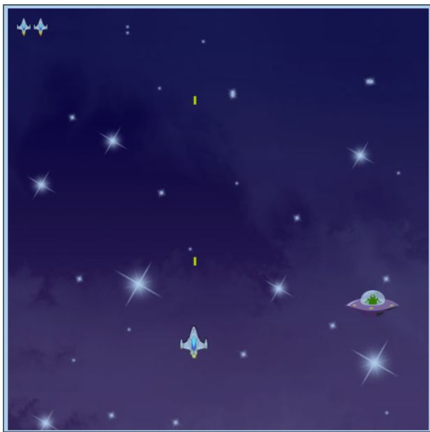

# JogoHTML5CanvasJavaScript-
Estudo do Canvas, ele é uma das maravilhas do HTML5.
O Canvas é uma área retangular em uma página web onde podemos
criar desenhos, usando JavaScript. Com esta tecnologia, podemos criar
trabalhos artísticos, animações e jogos, que é o assunto central deste projeto.
Irei desenvolver o jogo de plataforma como referencia ao da figura abaixo.

